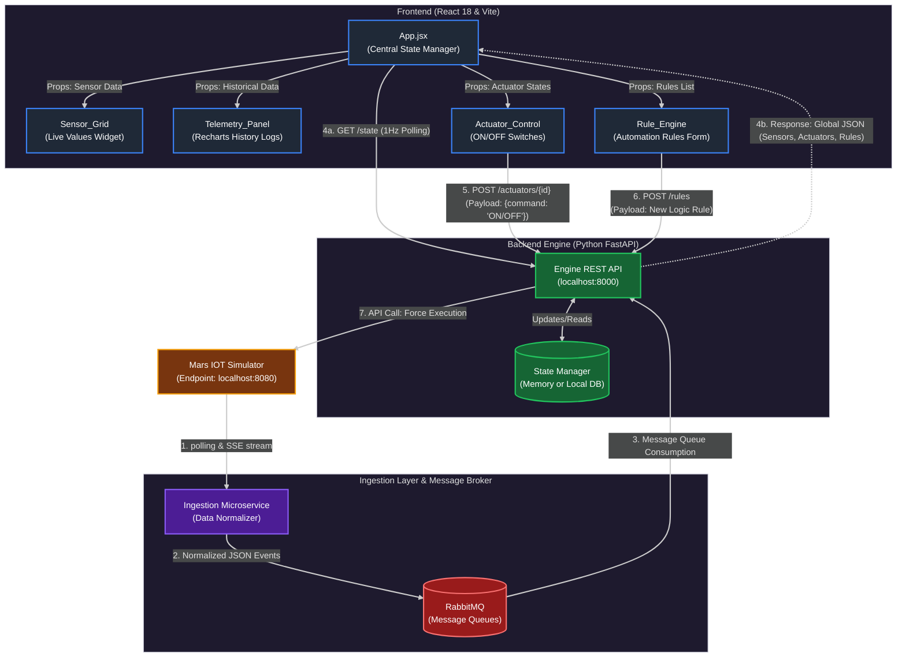
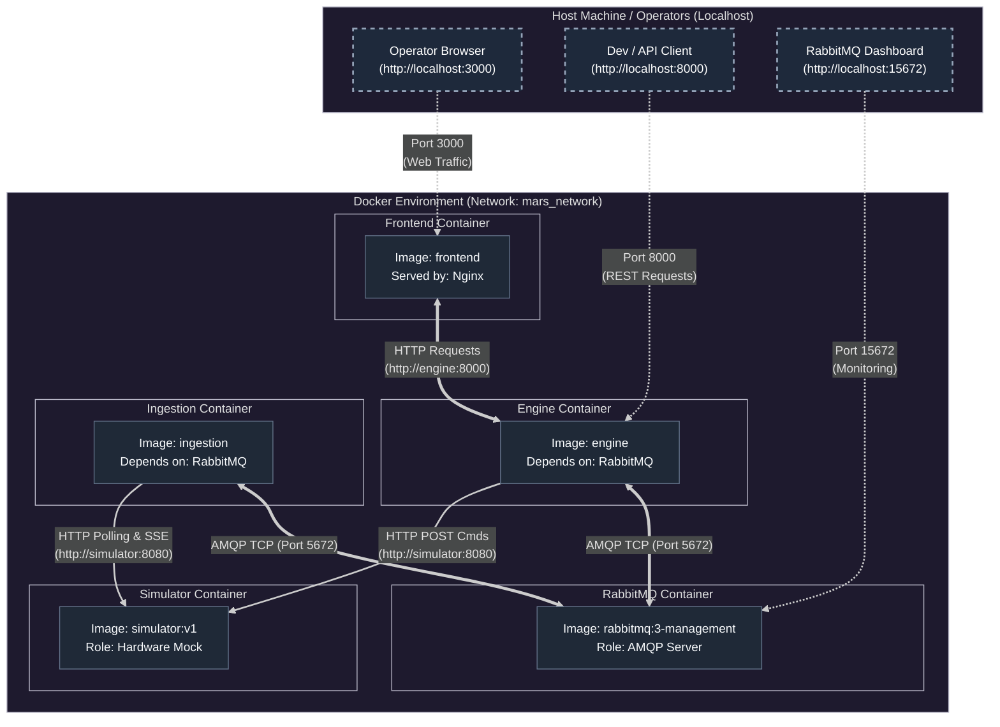

### A. Frontend Architecture & Component Diagram

This diagram visualizes the internal architecture of the React Single Page Application (SPA), showcasing how the main application orchestrates data flow and interacts with the external Backend API.

The Frontend architecture represents a clear separation of concerns:
*   **Centralized State Management:** The [App.jsx](cci:7://file:///Users/flavio/Desktop/2254421_DeployDudes/source/frontend/App.jsx:0:0-0:0) component acts as the single source of truth for the frontend layer. It handles both the cyclical read operations (1Hz polling to `/state`) and the distribution of data to its children via React Props.
*   **Decoupled UI Components:** The visual widgets (`Sensor_Grid`, `Telemetry_Panel`, `Actuator_Control`, `Rule_Engine`) are "dumb" presentation components. Their only responsibility is rendering data passed down from [App.jsx](cci:7://file:///Users/flavio/Desktop/2254421_DeployDudes/source/frontend/App.jsx:0:0-0:0) and triggering events when the user interacts with the UI.
*   **Asynchronous Actions:** While data fetching is cyclical, active commands from the operator (like switching an actuator or defining a rule) bypass the polling loop, firing immediate `POST` HTTP requests to the Backend Engine.




### B. Deployment Diagram (Docker Architecture)

This diagram illustrates the infrastructure and deployment strategy of the Mars Ops automation system. It maps the containerized microservices and their interactions over the internal Docker network (`mars_network`). 

This architecture highlights three key aspects of the system's design:
*   **Decoupling and Isolation:** All microservices run inside isolated containers within a private virtual network, strictly limiting who can communicate with whom (e.g., the Engine cannot directly access the UI).
*   **Security via Explicit Port Mapping:** Only specific ports are exposed to the external host machine (Port `3000` for the operator's dashboard, `8000` for API clients, and `15672` for RabbitMQ's admin panel). Direct external access to the physical simulator is intentionally blocked.
*   **Optimized Frontend Delivery:** The React SPA is containerized using a multi-stage Docker build and served in production by extremely lightweight and fast Nginx web server instances, ensuring high performance.




### C. State Machine Diagram (Automation Rule Lifecycle)

This detailed state machine diagram illustrates the complete lifecycle of an `IF-THEN` automation rule. It tracks the logical progression of the rule starting from its creation in the Frontend Operator UI, through backend validation, up to its continuous evaluation and execution cycle within the Engine's memory.

#### Key Architecture Takeaways:
*   **1. Frontend Isolation (Drafting):** The `Drafting` state exists exclusively in the volatile memory of the React SPA (`newRule` state). The Backend Engine remains entirely unaware of the rule until the operator officially commits it over HTTP.
*   **2. Edge Case Handling (Validation):** By implementing a `Validating` decision node, the architecture prevents corrupted rules from entering the active execution pool, bouncing the system back to the drafting state if required fields are missing.
*   **3 & 4. The Continuous Evaluation Engine:** Once a rule reaches the `Active & Idle` state inside the Python Engine, it enters a high-frequency evaluation cycle (`Evaluating`). This transition is strictly event-driven: it only occurs when a new telemetry packet is routed via RabbitMQ, ensuring zero idle CPU consumption.
*   **5. Non-Blocking Execution (Triggered):** When a rule condition evaluates to `True`, it shifts to the `Triggered` state and dispatches the execution command to the actuator. The rule instantaneously returns to `Idle` mode to await the next telemetry tick, decoupling logic evaluation from physical actuator response times.

```mermaid
---
config:
  theme: redux-dark
---
flowchart TD
    %% Custom Styling
    classDef startEnd fill:#10B981,stroke:#047857,stroke-width:2px,color:white
    classDef reactUI fill:#1F2937,stroke:#3B82F6,stroke-width:2px,color:white
    classDef backendApi fill:#4B5563,stroke:#9CA3AF,stroke-width:2px,color:white
    classDef decision fill:#D97706,stroke:#B45309,stroke-width:2px,color:white
    classDef execution fill:#DC2626,stroke:#991B1B,stroke-width:2px,color:white
    classDef activeState fill:#166534,stroke:#22C55E,stroke-width:2px,color:white

    %% Nodes Definitions
    Start((Start)):::startEnd
    Finish((End)):::startEnd
    
    Drafting["1. Drafting (In-Memory React)<br/><i>Operator selects: Sensor, Condition, Actuator</i>"]:::reactUI
    Validating{"2. Backend Validation<br/><i>Are payload parameters valid?</i>"}:::decision
    
    ActiveIdle[("3. Active & Idle<br/><i>Saved in Engine Database</i>")]:::activeState
    
    Evaluating{"4. Evaluating Logic<br/><i>Does incoming Telemetry<br/>match the IF condition?</i>"}:::decision
    
    Triggered["5. Triggered State<br/><i>Asynchronous POST to Actuator</i>"]:::execution
    Deleted["6. Deleted State<br/><i>Removed via DELETE API</i>"]:::backendApi

    %% The Flow
    Start -- "Operator opens Rule Builder" --> Drafting
    
    Drafting -- "Submits Form" --> Validating
    Validating -- "Rejection (Error 400)" --> Drafting
    Validating -. "Success (HTTP 200)" .-> ActiveIdle

    %% The Engine Infinite Loop
    ActiveIdle -- "New RabbitMQ Telemetry tick" --> Evaluating
    
    Evaluating -- "Condition NOT met (e.g. CO2 is Normal)" --> ActiveIdle
    Evaluating -- "Condition MET (e.g. CO2 is High)" --> Triggered
    
    Triggered -. "Hardware command sent" .-> ActiveIdle
    
    %% Termination Flow
    ActiveIdle -- "Operator presses Trash Bin icon" --> Deleted
    Deleted --> Finish

