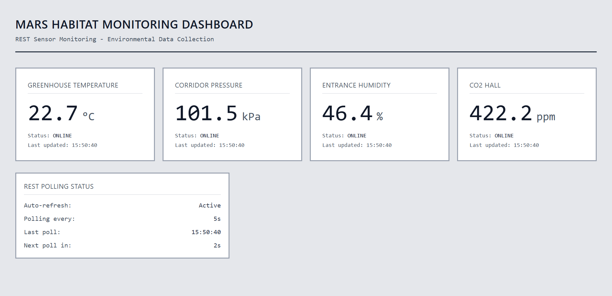
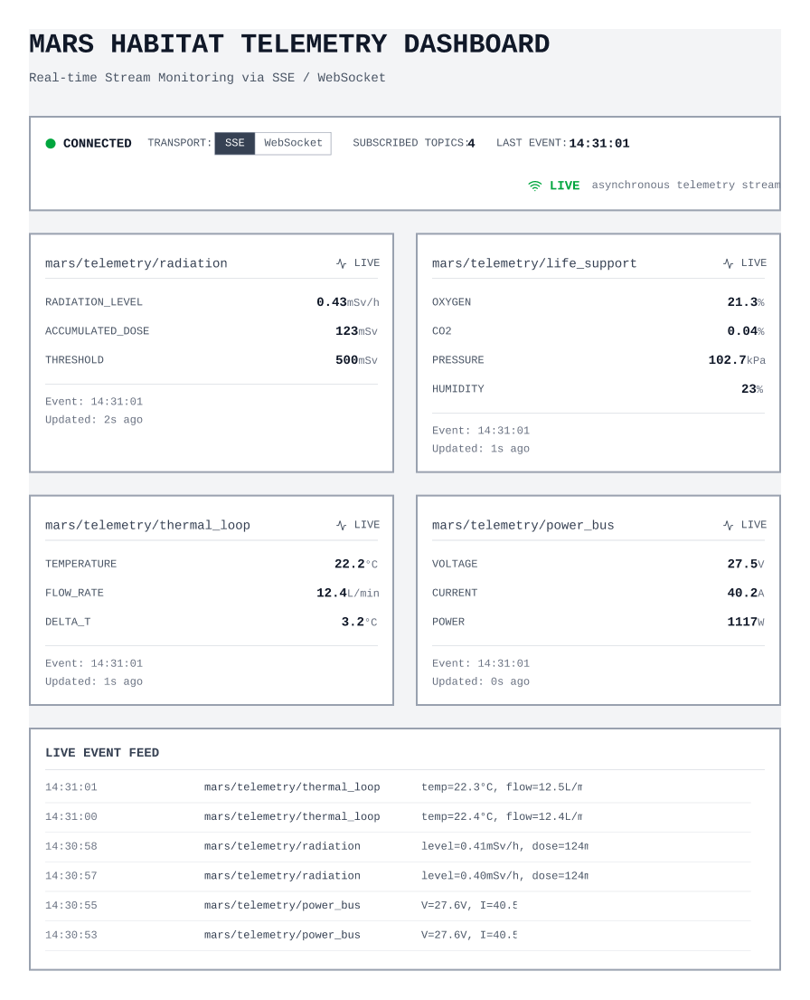

# User Stories Mockups Booklet

This booklet collects the LoFi mockups and the related textual descriptions for the user stories of the Mars habitat automation platform.

> Note: the complete list of user stories is documented in `input.md`. This booklet is meant to accompany those stories with mockups and short explanatory notes.

---

## US1 – REST sensor polling

### User story

> As a habitat operator, I want the platform to poll REST sensors at regular intervals, so that environmental data such as temperature and pressure is collected continuously.

### Mockup

### Textual description

This LoFi mockup represents the habitat operator dashboard for monitoring REST sensors. The interface shows the latest environmental values collected from REST devices, including temperature, pressure, humidity, and CO2 level. Each sensor card displays the current value, the sensor status, and the last update time, so the operator can verify that data collection is active.

The bottom section highlights the REST polling mechanism by showing auto-refresh status, polling frequency, last poll time, and next poll countdown. This makes clear that data is not received through streaming, but through regular polling intervals, while still being collected continuously over time.

### Non-functional aspects highlighted

- **Usability:** sensor values and polling status are immediately visible.
- **Clarity:** each card clearly identifies the sensor name, value, status, and update time.
- **Near real-time visibility:** the operator can quickly understand whether the monitoring dashboard is receiving fresh data.

---

## US2 – Telemetry stream connection

### User story

> As a habitat operator, I want the platform to connect to telemetry streams via SSE or WebSocket, so that real-time asynchronous data can be received continuously.

### Mockup

### Textual description

This LoFi mockup represents the habitat operator dashboard for monitoring telemetry streams. The interface shows live environmental and subsystem data received from stream-based devices through SSE or WebSocket. Each telemetry card displays the latest values, the stream status, and the last update time, so the operator can verify that real-time data reception is active.

The bottom section highlights the telemetry streaming mechanism by showing connection status, selected transport protocol, subscribed topics, and a live event feed. This makes clear that data is received asynchronously and continuously from active streams, rather than through periodic REST polling.

### Non-functional aspects highlighted

- **Usability:** live telemetry values and stream connection status are immediately visible.
- **Clarity:** each card clearly identifies the topic or subsystem, the latest data, the stream status, and the update time.
- **Real-time visibility:** the operator can quickly understand whether the dashboard is receiving continuous asynchronous updates.

---

## US3 – Data normalization

### User story

> As a platform engineer, I want incoming heterogeneous data to be converted into a standardized JSON event format, so that all internal services can process data consistently.

### Mockup

### Textual description

This LoFi mockup represents an internal dashboard for the platform engineer responsible for data normalization. The interface shows multiple incoming payloads generated by heterogeneous sources, such as REST sensors and telemetry streams, each with different field structures and formats. These payloads are processed by a normalization service that converts them into a single standardized internal JSON event.

The right side of the mockup highlights the unified output event schema used by downstream services. This makes clear that, although device payloads differ at ingestion time, all internal components can rely on a consistent event structure for further processing, message publication, caching, and rule evaluation.

### Non-functional aspects highlighted

- **Clarity:** the transformation from heterogeneous payloads to a unified event format is immediately understandable.
- **Consistency:** all downstream services can rely on the same internal JSON structure regardless of the original source format.
- **Maintainability:** separating source-specific parsing from the standardized internal schema simplifies system evolution and support for additional device types.

---

## US4 – Event publication to broker

### User story

> As a platform engineer, I want normalized events to be published to an internal message broker, so that ingestion is decoupled from downstream processing.

### Mockup

### Textual description

This LoFi mockup represents an internal platform engineering view of event publication after data normalization. The interface shows the normalization service producing standardized events and publishing them to an internal message broker. The broker acts as the central distribution point for normalized events and makes them available to multiple downstream services.

The right side of the mockup highlights independent downstream consumers such as the rule engine, latest-state cache, dashboard backend, and analytics services. This makes clear that ingestion does not communicate directly with each service, but instead publishes events once to the broker, allowing downstream components to consume them asynchronously and independently.

### Non-functional aspects highlighted

- **Decoupling:** ingestion and downstream services are separated through the broker, reducing direct dependencies between components.
- **Scalability:** multiple consumers can subscribe to the same normalized event stream without changing the ingestion service.
- **Maintainability:** new downstream services can be added more easily because event publication is centralized and based on a shared internal event format.

---

## US5 – Unreachable REST sensors handling

### User story

> As a platform engineer, I want the ingestion service to detect and mark unreachable REST sensors, so that polling failures can be handled without stopping the data collection pipeline.

### Mockup

### Textual description

This LoFi mockup represents an internal dashboard for monitoring the health of the REST ingestion service. The interface shows multiple REST sensors being polled regularly, together with their polling status, latest response time, and reachability. One sensor is explicitly marked as unreachable after a failed polling attempt, making the failure condition visible to the platform engineer.

The central section highlights the failure detection logic of the ingestion service by showing retry activity, polling errors, and the sensor state update from reachable to unreachable. The right side of the mockup emphasizes that the ingestion pipeline continues to operate for all other healthy sensors, so polling failures are isolated and handled without interrupting the overall data collection process.

### Non-functional aspects highlighted

- **Reliability:** polling failures are detected and isolated without causing a complete ingestion service stop.
- **Fault tolerance:** the pipeline continues processing reachable sensors even when one REST source becomes unavailable.
- **Observability:** sensor reachability, polling results, and failure events are clearly visible to the platform engineer.
