# User Stories Mockups Booklet

This booklet collects the LoFi mockups and the related textual descriptions for the user stories of the Mars habitat automation platform.

> Note: the complete list of user stories is documented in `input.md`. This booklet is meant to accompany those stories with mockups and short explanatory notes.

---

## US1 – REST sensor polling

### User story

> As a habitat operator, I want the platform to poll REST sensors at regular intervals, so that environmental data such as temperature and pressure is collected continuously.

### Mockup

### Textual description

This LoFi mockup represents the habitat operator dashboard for monitoring REST sensors. The interface shows the latest environmental values collected from REST devices, including temperature, pressure, humidity, and CO2 level. Each sensor card displays the current value, the sensor status, and the last update time, so the operator can verify that data collection is active.

The bottom section highlights the REST polling mechanism by showing auto-refresh status, polling frequency, last poll time, and next poll countdown. This makes clear that data is not received through streaming, but through regular polling intervals, while still being collected continuously over time.

### Non-functional aspects highlighted

- **Usability:** sensor values and polling status are immediately visible.
- **Clarity:** each card clearly identifies the sensor name, value, status, and update time.
- **Near real-time visibility:** the operator can quickly understand whether the monitoring dashboard is receiving fresh data.

---

## US2 – Telemetry stream connection

### User story

> As a habitat operator, I want the platform to connect to telemetry streams via SSE or WebSocket, so that real-time asynchronous data can be received continuously.

### Mockup

### Textual description

This LoFi mockup represents the habitat operator dashboard for monitoring telemetry streams. The interface shows live environmental and subsystem data received from stream-based devices through SSE or WebSocket. Each telemetry card displays the latest values, the stream status, and the last update time, so the operator can verify that real-time data reception is active.

The bottom section highlights the telemetry streaming mechanism by showing connection status, selected transport protocol, subscribed topics, and a live event feed. This makes clear that data is received asynchronously and continuously from active streams, rather than through periodic REST polling.

### Non-functional aspects highlighted

- **Usability:** live telemetry values and stream connection status are immediately visible.
- **Clarity:** each card clearly identifies the topic or subsystem, the latest data, the stream status, and the update time.
- **Real-time visibility:** the operator can quickly understand whether the dashboard is receiving continuous asynchronous updates.

---

## US3 – Data normalization

### User story

> As a platform engineer, I want incoming heterogeneous data to be converted into a standardized JSON event format, so that all internal services can process data consistently.

### Mockup

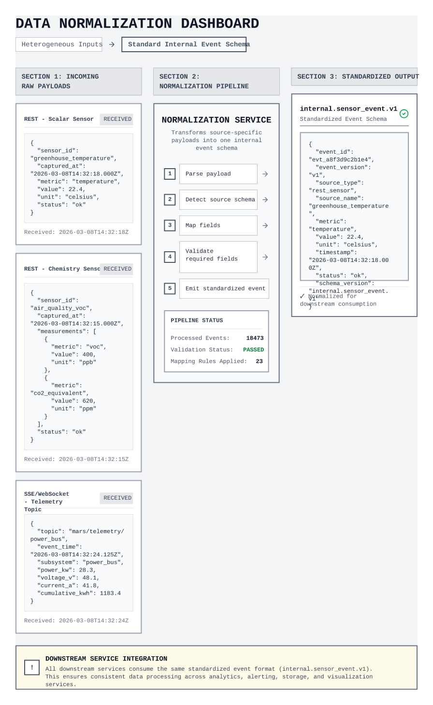

### Textual description

This LoFi mockup represents an internal dashboard for the platform engineer responsible for data normalization. The interface shows multiple incoming payloads generated by heterogeneous sources, such as REST sensors and telemetry streams, each with different field structures and formats. These payloads are processed by a normalization service that converts them into a single standardized internal JSON event.

The right side of the mockup highlights the unified output event schema used by downstream services. This makes clear that, although device payloads differ at ingestion time, all internal components can rely on a consistent event structure for further processing, message publication, caching, and rule evaluation.

### Non-functional aspects highlighted

- **Clarity:** the transformation from heterogeneous payloads to a unified event format is immediately understandable.
- **Consistency:** all downstream services can rely on the same internal JSON structure regardless of the original source format.
- **Maintainability:** separating source-specific parsing from the standardized internal schema simplifies system evolution and support for additional device types.

---

## US4 – Event publication to broker

### User story

> As a platform engineer, I want normalized events to be published to an internal message broker, so that ingestion is decoupled from downstream processing.

### Mockup

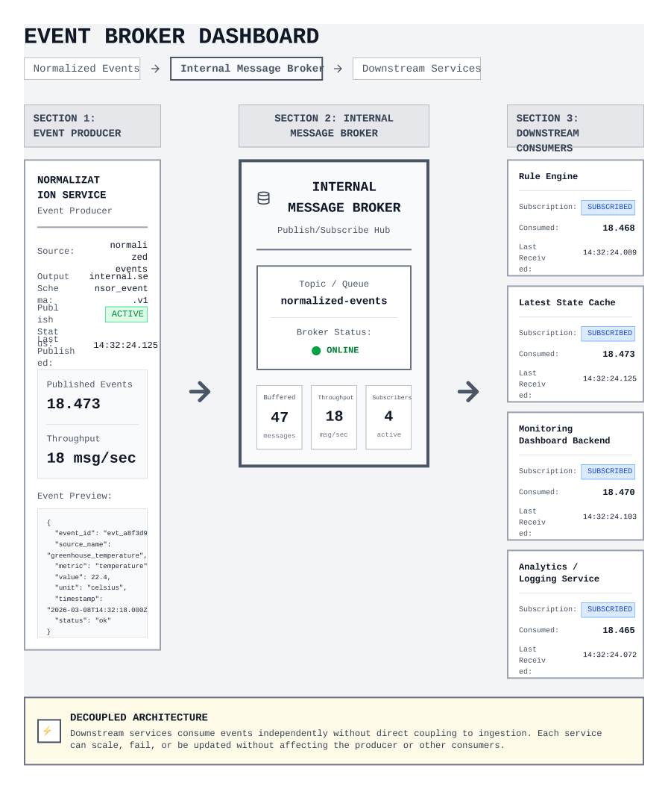

### Textual description

This LoFi mockup represents an internal platform engineering view of event publication after data normalization. The interface shows the normalization service producing standardized events and publishing them to an internal message broker. The broker acts as the central distribution point for normalized events and makes them available to multiple downstream services.

The right side of the mockup highlights independent downstream consumers such as the rule engine, latest-state cache, dashboard backend, and analytics services. This makes clear that ingestion does not communicate directly with each service, but instead publishes events once to the broker, allowing downstream components to consume them asynchronously and independently.

### Non-functional aspects highlighted

- **Decoupling:** ingestion and downstream services are separated through the broker, reducing direct dependencies between components.
- **Scalability:** multiple consumers can subscribe to the same normalized event stream without changing the ingestion service.
- **Maintainability:** new downstream services can be added more easily because event publication is centralized and based on a shared internal event format.

---

## US5 – Unreachable REST sensors handling

### User story

> As a platform engineer, I want the ingestion service to detect and mark unreachable REST sensors, so that polling failures can be handled without stopping the data collection pipeline.

### Mockup

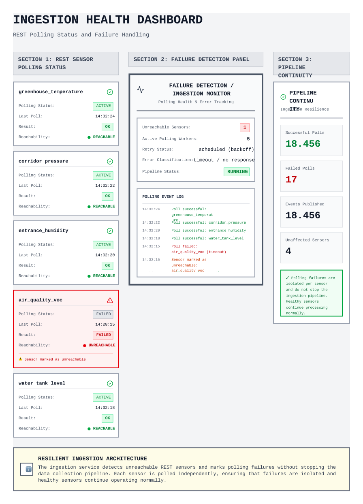

### Textual description

This LoFi mockup represents an internal dashboard for monitoring the health of the REST ingestion service. The interface shows multiple REST sensors being polled regularly, together with their polling status, latest response time, and reachability. One sensor is explicitly marked as unreachable after a failed polling attempt, making the failure condition visible to the platform engineer.

The central section highlights the failure detection logic of the ingestion service by showing retry activity, polling errors, and the sensor state update from reachable to unreachable. The right side of the mockup emphasizes that the ingestion pipeline continues to operate for all other healthy sensors, so polling failures are isolated and handled without interrupting the overall data collection process.

### Non-functional aspects highlighted

- **Reliability:** polling failures are detected and isolated without causing a complete ingestion service stop.
- **Fault tolerance:** the pipeline continues processing reachable sensors even when one REST source becomes unavailable.
- **Observability:** sensor reachability, polling results, and failure events are clearly visible to the platform engineer.

### US6 – In-Memory Sensor State Caching

#### User story

> As a system administrator, I want the system to cache the most recent state of each sensor in memory, to always have the latest value for rapid evaluation.

#### Mockup

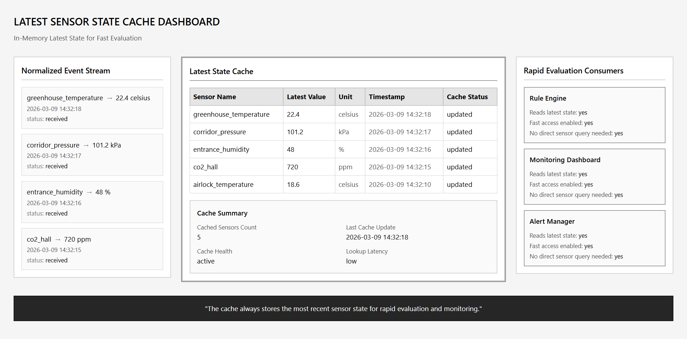

#### Textual description

This LoFi mockup represents a "Live System State" panel within the operator dashboard. The interface displays a grid of currently active sensors alongside a system metric widget showing "Cache Read Latency" (e.g., < 1ms). Instead of showing loading spinners typical of database queries, the sensor values appear instantaneously.

The design highlights that the data is being served directly from the Engine's RAM (in-memory dictionary) rather than disk storage, ensuring that the automation logic always has zero-latency access to the absolute latest telemetry data.

#### Non-functional aspects highlighted

- Performance: ultra-low latency reads ensure immediate data availability.
- Efficiency: eliminates heavy database I/O operations for constantly changing telemetry.
- Scalability: the memory footprint remains small since only the latest state is kept, rather than a full historical log.

### US7 – Automation Rule Persistence

#### User story

> As a system administrator, I want the automation rules to be persisted in a database, so that they survive system restarts.

#### Mockup

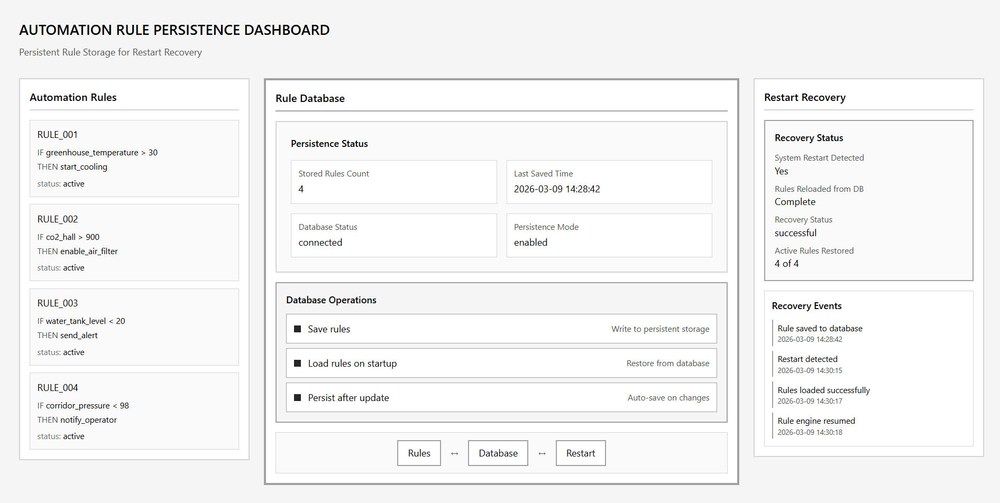

#### Textual description

This LoFi mockup illustrates the backend reliability of the rule management system. The interface shows a list of configured automation rules with a prominent "Saved to SQLite Database" status indicator next to each entry.

A secondary panel simulates a "System Restart" event. The mockup clearly demonstrates that after the Engine container goes offline and comes back online, the rules table immediately repopulates without any data loss. This guarantees that critical life-support logic is never lost during unexpected outages or routine maintenance.

#### Non-functional aspects highlighted

- Reliability: critical system logic survives infrastructure crashes.
- Resilience: automatic recovery of the habitat's behavior without human intervention.
- Data Integrity: ensures that configurations saved by the operator are permanently stored on disk.

### US8 – Event-Driven Rule Evaluation

#### User story

> As a platform engineer, I want rules to be dynamically evaluated whenever a new event arrives to trigger emergencies.

#### Mockup

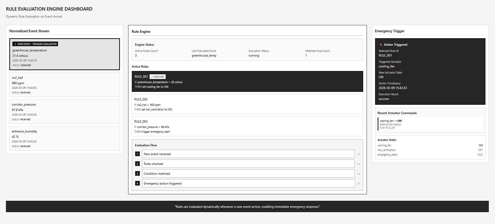

#### Textual description

This LoFi mockup depicts a real-time system log or evaluation timeline. The interface is split into two halves: the left side shows a stream of incoming JSON events arriving from the RabbitMQ broker, and the right side shows the Automation Engine's evaluation engine.

When a critical event arrives (e.g., greenhouse_temperature: 35.0), a visual lightning bolt or "Match" icon instantly flashes on the screen connecting the incoming event to a specific persisted rule. It visually emphasizes that the system reacts push-style (instantly upon message consumption) rather than pull-style (waiting for a periodic timer to check the database).

#### Non-functional aspects highlighted

- Responsiveness: immediate reaction to critical environmental changes.
- Architectural Decoupling: the evaluation is triggered entirely by asynchronous messages.
- Traceability: the operator can see exactly which event triggered which rule in real-time.

### US9 – Automated Actuator Triggering

#### User story

> As a platform engineer, I want the system to send a POST request to the simulator when a rule is satisfied to change actuator states.

#### Mockup

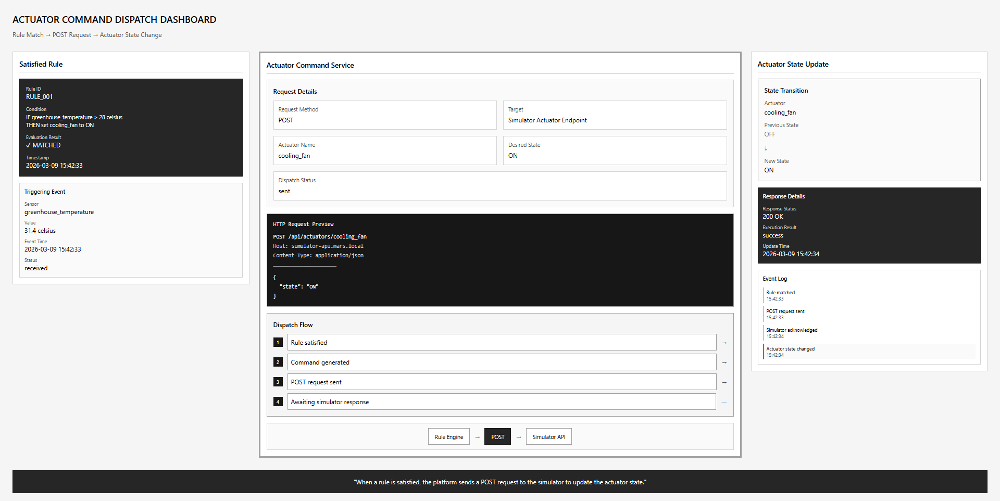

#### Textual description

This LoFi mockup represents the "Hardware Execution" view of the dashboard. It shows a visual representation of a Martian actuator, such as a Cooling Fan.

The interface captures the exact moment an automation rule is satisfied. A system notification pops up stating "Condition Met: Sending HTTP POST to /api/actuators/cooling_fan". Immediately after, the UI reflects the actuator's status changing autonomously from OFF to ON. This demonstrates the closed-loop nature of the system, where software logic successfully interfaces with the external physical (simulated) world.

#### Non-functional aspects highlighted

- System Autonomy: the habitat self-regulates without requiring human clicks.
- Interoperability: standardized REST communication is used to command external services.
- Feedback: clear visual confirmation that the software command has been dispatched.

### US10 – Active Rules Dashboard

#### User story

> As a habitat operator, I want to view a list of all active automation rules in the system.

#### Mockup

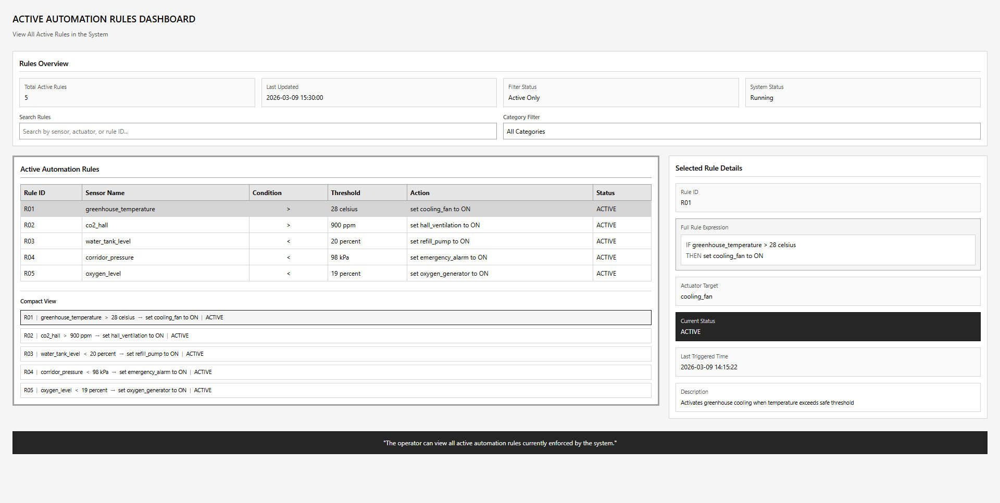

#### Textual description

This LoFi mockup showcases the "Rule Management" page. The interface provides a clean, easily readable tabular layout displaying all active IF-THEN rules fetched from the backend API (GET /rules).

Each row represents a single rule, clearly breaking down the logic into columns: Rule ID, Target Sensor, Logical Operator (e.g., >, <), Threshold Value, and Target Actuator State. The design prioritizes readability, allowing an operator to audit the habitat's safety protocols at a single glance. It may also include a "Delete" button next to each rule for full lifecycle management.

#### Non-functional aspects highlighted

- Usability: complex JSON logic is translated into a human-readable table.
- Transparency: operators have full visibility into the system's automated behaviors.
- Manageability: provides a centralized hub for auditing life-support configurations.

## US11 – Real-time Dashboard Overview

### User story
As a user, I want to view a real-time dashboard in order to monitor the overall status of the base.

### Mockup
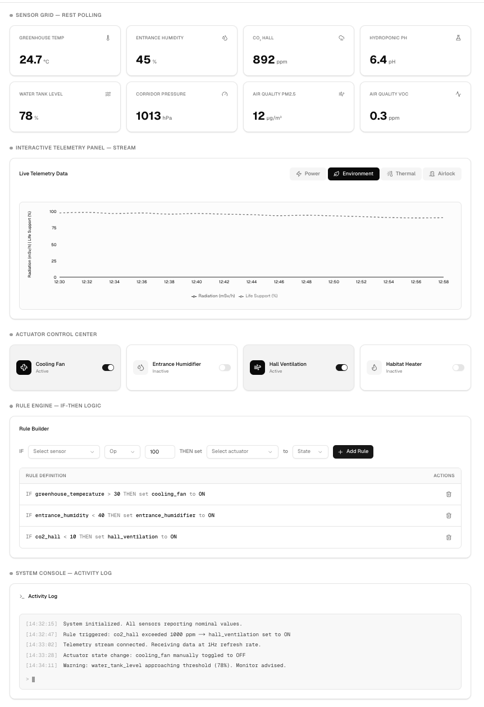

### Textual description
Upon initial loading of the frontend application, the user lands on the main dashboard of the "Mars Ops" system. The interface is presented as a logical and organized Single Page Application (SPA) that simultaneously aggregates and displays all vital subsystems of the Martian habitat (sensor grid, telemetry panel, actuator controls, and rule logic). The presented data is not static but reflects the current live state of the base.

### Non-functional aspects highlighted
*   **Performance:** The dashboard instantly loads the visual infrastructure, populating data asynchronously to avoid blocking page rendering.

## US12 – Specific Sensor Monitoring

### User story
As a user, I want to see the real-time value of a specific sensor (e.g., water tank level) through a dedicated widget.

### Mockup
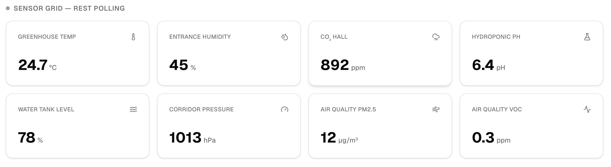

### Textual description
Within the dashboard, the user can locate the "Sensor Grid", a section composed of individual cards (widgets) each dedicated to a specific environmental parameter (e.g., Greenhouse Temp, Humidity, CO2, Water Level). Each widget clearly displays the sensor name, a representative icon, the exact numerical value synchronized with the backend, and the corresponding unit of measurement. If a value changes, the widget visually highlights the update.

### Non-functional aspects highlighted
*   **Reliability (Data Freshness):** Values displayed in the widgets are kept up-to-date via a continuous *polling* mechanism (1-second interval) interacting with the Engine's REST API.

## US13 – Telemetry Line Chart Visualization

### User story
As a user, I want to view a line chart for telemetry streams that continuously updates while the page is open.

### Mockup
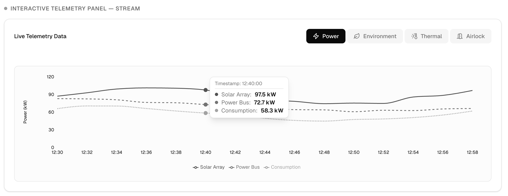

### Textual description
The user can analyze the historical trends of various vital parameters via the "Interactive Telemetry Panel". This section allows navigation through different data streams using "Tabs" (e.g., Solar Array, Radiation, Life Support). Once a tab is selected, a multivariate line chart is displayed where the X-axis represents the timeline (timestamp) and the Y-axis the measured values. The chart scrolls and updates progressively in real-time as new data is generated by the base.

### Non-functional aspects highlighted
*   **Performance (Rendering):** Utilization of the specialized `Recharts` library coupled with React's `useMemo` hook to ensure smooth recalculation and drawing of the chart (at 60fps) even during high-frequency data reception, preventing UI lag.
*   **Usability:** Inclusion of an interactive [CustomTooltip](cci:1://file:///Users/flavio/Desktop/2254421_DeployDudes/source/frontend/App.jsx:438:0-476:1): by hovering over the chart, the operator can read the exact value of all parameters at a precise timestamp.

## US14 – Actuator State Monitoring

### User story
As a user, I want to see the current state of actuators (e.g., whether the humidifier is ON or OFF) directly from the dashboard.

### Mockup
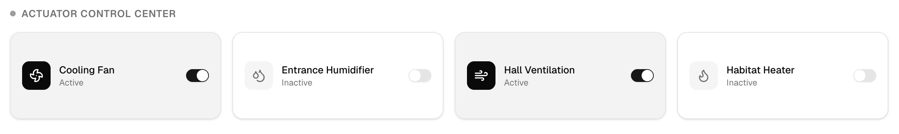

### Textual description
Also on the main dashboard, in the "Actuator Control Center" section, the user can see at a glance which physical systems of the habitat are currently running and which are off. Each actuator (e.g., Cooling Fan, Heater) is represented in a widget that explicitly states its textual status ("Active" or "Inactive"). When an actuator turns on (either by manual command or automatic rule execution), its corresponding icon begins to animate.

## US15 – Manual Actuator Control (Toggle)

### User story
As a user, I want a toggle button on the dashboard to manually turn an actuator ON or OFF if necessary.

### Mockup
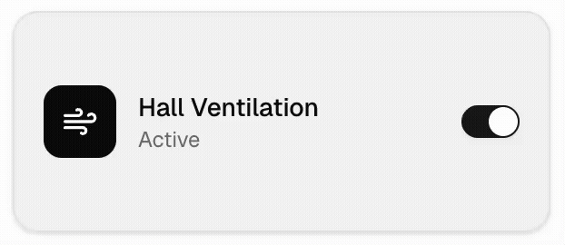

### Textual description
In case of necessity or in the absence of automatic rules, the operator can take direct control of the physical systems. Next to each actuator displayed in the "Actuator Control Center", the user is provided with an interactive toggle switch. Upon clicking the toggle, the frontend immediately processes the user's intent, invokes the backend API to force state inversion ("from ON to OFF" or vice versa), and updates the graphics to reflect the new command.

### Non-functional aspects highlighted
*   **Interoperability:** The user's action is instantly translated into an asynchronous `POST` HTTP request, independent from the normal reading *polling* cycle, dispatching a structured JSON payload to the Engine's `/actuators/{id}` endpoint.

## US16 – Automation Rule Builder

### User story
As a user, I want a dedicated interface with form inputs to create IF-THEN logic rules.

### Mockup
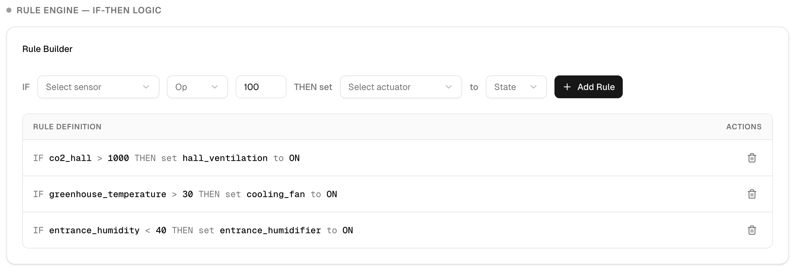

### Textual description
In the "Rule Engine" panel, the user has the ability to configure base automation, offloading the need for manual control. By interacting with an intuitive form (the *Rule Builder*), the operator can construct a logical sentence by selecting from dropdown menus: "IF" a certain sensor, is "GREATER/LESS/EQUAL" to a manually inputted target value, "THEN" set a specific actuator to an "ON/OFF" state. By pressing the add button, the rule is created, registered in the system, and displayed in the textual list of active rules below.

### Non-functional aspects highlighted
*   **Robustness (Data Validation):** The frontend prevents the submission of empty or malformed rules by disabling the form action until all required parameters (Sensor, Operator, Target value, Actuator, Desired state) have been successfully populated by the user, thus preventing disastrous automation errors on the backend side.
*   **Maintainability:** The available parameters in the dropdown menus are not statically hardcoded; they depend on the system configuration decoded and processed by the React layer.

